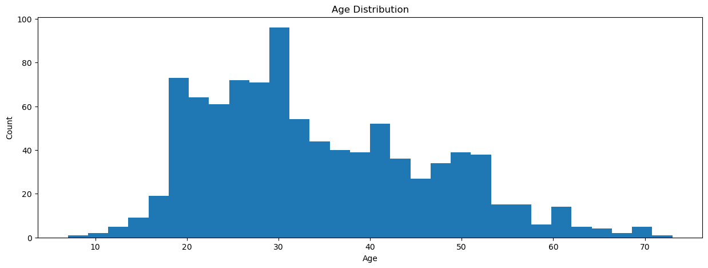
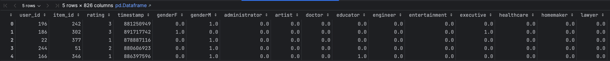

# PMLDL Assignment 2 Final Report

## Movie Recommender System with Neural Networks

**Lev Rekhlov, BS21-DS-02, l.rekhlov@innopolis.university**

## 1. Idea.

To create a recommender system with the provided dataset(users, movies and ratings), I started from the ground:
how it will work? based on what data? what it will output?

Here are several variants I came up with:

- **User + Movie -> Rating**. In such setup, the system should get information about user,
  then the model predicts "what rating will user give to each film in database" and outputs top K suggestions.
- **Movie + Ratings -> Users**. Based on known ratings, the model outputs who will like this movie and recommends it
  them.
- **User + Ratings -> Movies**. We 'capture' the user behavior and trying to predict movies which user is likely to
  watch next.

As a rule of thumb, I want my recommender system to be simple and easily repeatable. My decision was: **User + Movie ->
Rating**.

Such system can be easily solved as **classification task**: model predicts one of 5 ratings,
and then we sort all result by rating, giving only top 5-10 to user.

## 2. Feature Engineering and dataset preparation.

Let's create features for each type of entities: User and Movie, step by step.

### 2.1 User Representation

Initial dataset gives us the following knowledge about user: `gender`, `age`, `occupation` and `zipcode`.

`Gender` and `occupation` columns can be easily encoded using **One-Hot Encoding**. It simple, yet efficient method to
encode categorical variables.

The `age` column contains integers from 7 to 73. Let's look at histogram:

The number of different ages is high, so I decided to categorize them into bins:

- 0-18 age
- 18-25 age
- 25-35 age
- ...

In total, I got 6 bins, which are also One-Hot Encoded.

### 2.2 Movie Representation

As for the movies: we have `title`, `release_date` and `genres` columns. Other columns I preliminarily filtered out, as
well as the rows with 'unknown' genre.

Column `genre` was again One-Hot Encoded(wow).

For the `release_date` I used the same strategy as for the `age` column. Firstly, I left only the year of release, as
most of the movies were released at 1'st of January. Then, I divided the years into bins and One-Hot Encoded them.

The most interesting part is the `title` column. First idea that came to me was to encode the title using **BERT**. Why:

- Old but gold. BERT is a well-known model, which is used in many NLP tasks.
- Easy to do. Many articles/repos/tutorials on the Internet.
- Pretrained BERT already can encode words very well without fine-tuning.

So, I used it and as a result got 768-dimensional vector for each movie title, which is a sum of embeddings for each
word in title.

### 2.3 Final Prepared Dataset

After calculating all necessary features, I merged them with `ratings` dataset. Resulting columns:

- `user_id` and `movie_id` - identifiers of user and movie
- `timestamp` - timestamp of rating(will be used later for train/test split)
- `rating` - rating given by user to movie
- `bert0...bert767` - 768-dimensional vector of movie title
- 18 columns of movie genres
- 6 columns of user age
- 7 columns of movie release year
- 21 columns of user occupation

This dataset can be used for training/testing in the following way: given user + movie embedding -> predict rating.

## 3. Baseline Model

...

## 4. Final Model

...

## 5. Evaluation

...

## 6. Conclusion

...

